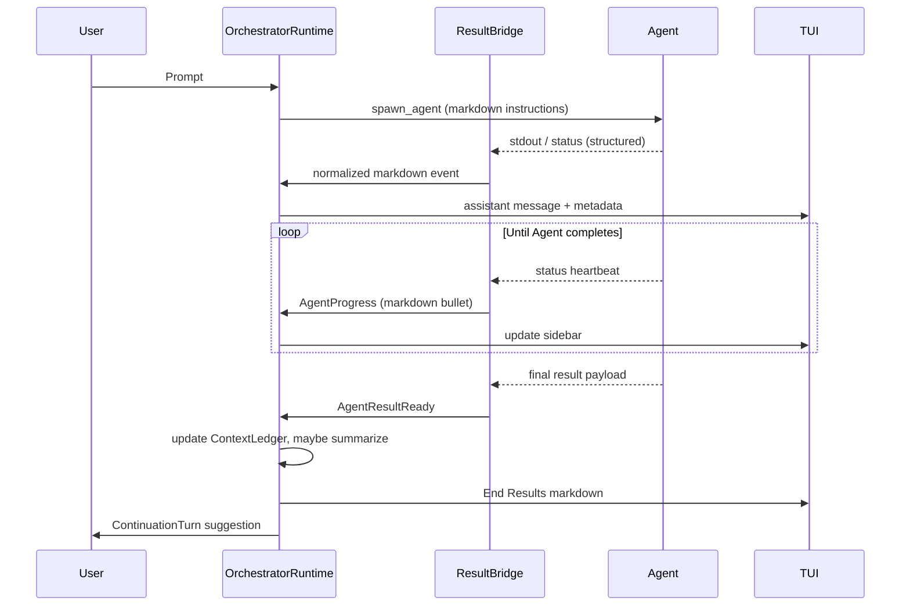

# Orchestrator Workflow Design

## Objectives

- Deliver a markdown-first orchestration experience where every visible response is formatted before it reaches the TUI or API clients.
- Keep agents discoverable, auditable, and interruptible from both the CLI and the Codex TUI.
- Manage conversation context proactively so that long-running orchestrations stay within the model window without losing essential detail.
- Ensure the primary (parent) agent resumes work after subagents finish and the end-results section renders, enabling follow-up questions or additional delegations within the same thread.

These objectives respond directly to the current gaps: markdown output often appears as raw text, spawned agents are difficult to inspect once work starts, context growth causes truncation in longer sessions, and the orchestrator frequently stops after presenting aggregated results.

---

## Experience Overview

### Narrative Flow

1. **Main agent plans**: The orchestrator analyses the user prompt, produces a plan as markdown, and issues `spawn_agent` tool calls.
2. **Subagents work**: Each subagent streams status updates and formatted output into the shared conversation.
3. **Results land in End Results drawer**: The orchestrator aggregates subagent outputs, formats them as markdown, and renders them inside the End Results section with collapsible blocks per agent.
4. **Main agent resumes**: After End Results renders, the orchestrator posts a follow-up message summarizing the state and offering next steps. The user can continue interacting within the same thread.

### TUI Requirements

- Markdown renderer must run for **every** assistant-visible message. For shared code, rely on the existing renderer used by chatwidget.
- Agent overview sidebar shows live status, elapsed time, and entry points to view full logs. Selecting an agent focuses their conversation snippet.
- Context meter indicates aggregated token usage from orchestrator + subagents. When nearing capacity, a warning banner prompts manual or automatic pruning.

---

## Functional Requirements

### Markdown Rendering

- All orchestrator-authored messages pass through a `MarkdownEnvelope` prior to being emitted as `Event::AssistantSaid`.
- Subagent output is wrapped in markdown fences or block quotes to keep raw stdout readable. The ResultBridge (see Runtime) annotates messages with `content_type: "markdown"` so the TUI renderer can treat them correctly.
- The TUI must run `markdown::render_lines` (existing helper in `codex-rs/tui/src/chatwidget.rs`) on every message before it is written to the buffer. This ensures headings, lists, and code blocks render.
- If an agent emits plain text that cannot be parsed, we fallback to escaping HTML entities and wrapping the block in ```` ```text ``` ```` to avoid broken formatting.

### Consistent Response Formatting

- Standardize the summary template:
  1. Heading containing agent name and outcome emoji.
  2. Bullet list of key findings or file changes.
  3. Optional “Next Steps” section.
- For End Results, the orchestrator uses `ResultComposer` (new helper described below) to merge agent data into the template. This ensures parity between TUI and API responses.
- Validation rules in `codex-rs/core/src/tools/spec.rs` enforce that `spawn_agent` tool arguments include a `display_name` so the UI can render consistent titles.

### Agent Accessibility

- Maintain an in-memory registry (`AgentDirectory`) keyed by `agent_id` with:
  - Display name, mode, purpose.
  - Conversation excerpt pointer.
  - Control handles for cancellation and log retrieval.
- Expose directory operations through:
  - `orchestrator.show_agents` command palette entry in the TUI (shortcut `[A]`).
  - `codex orchestrator agents` CLI command, returning markdown tables.
- Provide per-agent “open in focus view” action that loads the child conversation stream into the right pane while keeping main conversation visible.
- All synthetic messages include `metadata.agent_id` so downstream clients can filter or group by agent.

### Context Management

- Track combined token usage across main conversation and all subagents via `ContextLedger`.
- When usage exceeds 80% of the smallest context window among active models:
  - Trigger automatic summarization for completed agents using `SummaryJob` tasks.
  - Replace verbose logs with short summaries and store the original text inside the Result Archive (`orchestrator/.contexts/<agent_id>.md`) for on-demand retrieval.
- Provide `[P]` shortcut in the TUI to request manual pruning. Dialog lists candidate agents and estimated savings.
- Summaries keep Markdown structure (lists, headings) so re-rendering remains stable.

### Main Agent Continuation

- After End Results render, orchestrator schedules a `ContinuationTurn`:
  - Reads the aggregated agent summaries.
  - Posts a markdown message with follow-up guidance (e.g., “Would you like me to run tests?”).
  - Leaves the conversation open for further user input; no forced termination.
- If the user issues new commands, the orchestrator may reuse completed agents or spawn new ones; `AgentDirectory` tracks availability.

---

## Runtime Architecture

### Components

| Component | Responsibility | Location |
|-----------|----------------|----------|
| `OrchestratorRuntime` | Owns main loop, handles tool calls, orchestrates ContinuationTurn | `codex-rs/orchestrator/src/runtime.rs` |
| `ResultBridge` | Receives streamed agent output, normalizes markdown, forwards to conversation | `codex-rs/orchestrator/src/runtime.rs` |
| `AgentDirectory` | Tracks metadata + control handles | `codex-rs/orchestrator/src/runtime.rs` |
| `ContextLedger` | Aggregates token counts, triggers pruning jobs | `codex-rs/orchestrator/src/truncation.rs` |
| `SummaryJob` | Produces condensed markdown summaries via LLM | `codex-rs/orchestrator/src/truncation.rs` |
| `ResultComposer` | Builds final End Results markdown | New helper in `codex-rs/orchestrator/src/runtime.rs` |

### Event Flow



### State Machine

```
Idle → Planning → Delegating → AwaitingResults → ComposingResults
        ↑                                      ↓
    Continuing ← FollowUpReady ← ContinuationTurn
```

- `AwaitingResults` watches active agents via `JoinSet`. When all complete, it transitions to `ComposingResults`.
- `ContinuationTurn` is mandatory unless user cancels the run; skipping would violate the “main agent continues” requirement.

---

## TUI Integration

### Chat Stream

- `chatwidget.rs` renders each assistant message through the markdown renderer before converting to ratatui `Line`s.
- For agent messages, attach badges using Stylize helpers (`badge_text.cyan().bold()` etc.) and indent with two spaces for hierarchy.
- Use `word_wrap_lines` from `tui/src/wrapping.rs` to wrap rendered lines while respecting markdown bullet indentation.
- Context meter lives in the footer (`tui/src/bottom_pane/footer.rs`) and pulls data via a new channel that streams `ContextLedger` snapshots.

### Agent Drawer

- Located beneath the planning message during orchestration.
- Each row: status icon, agent display name, elapsed time, `[Enter]` to expand details.
- Expanded view shows latest markdown summary plus actions: `[O]` open logs, `[C]` cancel, `[P]` prune summary.
- Drawer remains available after End Results so the user can revisit agent details.

### End Results Panel

- Rendered as a markdown section using the same renderer; code blocks from agents stay intact.
- Provide quick links back to agent logs (`[View agent log](codex://agent/<id>)` placeholder handled by CLI to open focus view).
- Once End Results collapse, conversation focus returns to the main agent message that follows.

---

## API & Tooling Contracts

1. **`spawn_agent`**  
   - Input now requires `display_name`.  
   - Returns `{ "agent_id": "...", "status": "running" }`.
   - Automatically registers the agent inside `AgentDirectory`.

2. **`submit_subagent_result`**  
   - Agents report completion with `{ agent_id, status, markdown_output, metrics }`.  
   - `markdown_output` must already be formatted; ResultBridge verifies and wraps if necessary.

3. **`report_progress`** (new optional tool)  
   - Allows agents to stream formatted status updates.  
   - Stored as collapsible timeline entries.

4. **Metadata schema** (attached to each assistant event):
   ```json
   {
     "agent_id": "main" | "<subagent>",
     "content_type": "markdown",
     "context_tokens": {
       "total": 1024,
       "limit": 3072
     }
   }
   ```

---

## Context Management Details

- `ContextLedger` pulls token counts from the model adapters at the end of each tool call.
- Summaries are produced using the main model unless `summary_profile` is configured; all summaries are stored alongside checksum hashes to prevent repeated work.
- For large attachments (e.g., diff logs), we relocate them to `Result Archive` and insert a markdown link referencing the file.
- Automatic pruning runs in a background task so it does not block the orchestrator loop; when pruning completes it emits a system message: `"[Context] Summarized agent code_2 output (saved 1,234 tokens)."`.
- The ledger also exposes structured data to analytics to graph usage over time.

---

## Continuation Strategy

- After composing End Results, orchestrator gathers open threads:
  - Incomplete checklist items.
  - Subagent failures or warnings.
  - User questions extracted from the latest user message.
- Generates a `ContinuationTurn` message:
  ```
  ## Next Steps
  - ✅ All refactors applied.
  - ⚠️ Tests not run (agent test_runner failed).
  Would you like me to retry the tests or prepare a PR summary?
  ```
- Conversation remains active; if the user responds, the orchestrator enters `Continuing` state, reusing the existing context and agents as needed.

---

## Testing Strategy

1. **Unit Tests**  
   - Validate markdown normalization logic in `ResultBridge`.  
   - Ensure `ContinuationTurn` fires exactly once per run.  
   - Simulate oversized context and assert pruning summaries replace raw logs.

2. **Integration Tests**  
   - End-to-end run with three agents where one fails; verify End Results render markdown with proper badges.  
   - Scenario where user responds after End Results to confirm the orchestrator continues the thread.  
   - CLI agent list command returns markdown table with accessible controls.

3. **TUI Snapshot Tests**  
   - Agent drawer (collapsed & expanded).  
   - End Results section with mixed success/failure agents.  
   - Continuation message after End Results.

4. **Manual QA**  
   - Smoke test markdown rendering for headings, lists, code blocks, tables.  
   - Verify context meter warnings and manual pruning dialog.

---

## Implementation Phases

1. **Runtime Foundations (Week 1-2)**  
   - Introduce `AgentDirectory`, `ResultBridge`, `ContextLedger`.  
   - Update tool specs and runtime to enforce display name + metadata.  
   - Add continuation turn logic.

2. **Formatting & Markdown Pipeline (Week 2-3)**  
   - Implement markdown normalization and ensure ResultComposer templates.  
   - Extend tests for formatting guarantees.

3. **TUI Enhancements (Week 3-4)**  
   - Update chatwidget to render markdown everywhere.  
   - Build agent drawer, context meter, End Results panel refresh.  
   - Snapshot coverage.

4. **Context Pruning + Archive (Week 4-5)**  
   - Implement summarization jobs, archive storage, manual pruning UX.  
   - Performance profiling with long sessions.

5. **Polish & Rollout (Week 5-6)**  
   - CLI command additions.  
   - Telemetry for continuation turns and pruning.  
   - Write documentation + migration guide.

---

## Open Questions & Risks

- **Markdown fidelity**: How do we guarantee external agents emit valid markdown? Option: offer helper libraries per language to format responses.
- **Archive storage limits**: Need retention policy for saved logs to avoid disk bloat.
- **Continuation fatigue**: If every run ends with a continuation prompt, does it feel repetitive? Consider detecting when no obvious next steps exist and offer a concise close-out instead.
- **Concurrency edge cases**: Ensure summarization jobs cannot race with manual log viewing (need read-through caching).

---

## References

- Runtime scaffolding: `codex-rs/orchestrator/src/runtime.rs`
- Tool definitions: `codex-rs/core/src/tools/spec.rs`
- TUI renderer: `codex-rs/tui/src/chatwidget.rs`
- Footer controls: `codex-rs/tui/src/bottom_pane/footer.rs`
- Context helpers: `codex-rs/orchestrator/src/truncation.rs`

This design centers markdown rendering, consistent formatting, agent accessibility, managed context, and continued main-agent guidance—bridging the usability gaps seen in the current orchestrator workflow.
